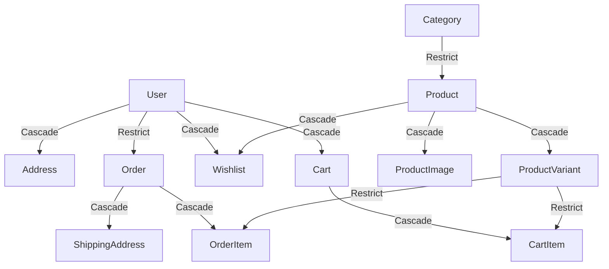

# 📋 Detail Workflow: Database Schema & Relational Design

Dokumen ini mendetailkan struktur tabel, tipe data, indeksasi, dan aturan relasi database PostgreSQL menggunakan Prisma ORM.

---

## 1. Pemetaan Relasi & Aksi Cascade
Dalam e-commerce, penghapusan data induk harus dikelola dengan hati-hati untuk menjaga integritas transaksi keuangan. Berikut adalah aturan penghapusan yang diterapkan pada BARBARA:

### 1.1 `onDelete: Cascade` (Hapus Otomatis Anak)
- **Product ➔ ProductVariant / ProductImage**: Jika produk dihapus dari database, semua varian ukuran/warna dan gambarnya harus terhapus otomatis untuk menghindari data sampah.
- **Cart ➔ CartItem**: Menghapus keranjang belanja wajib membersihkan semua item di dalamnya.
- **Order ➔ OrderItem / ShippingAddress**: Jika entitas order dihapus (hanya diperbolehkan saat development/pembersihan), semua item pesanan dan alamat pengiriman pesanan tersebut harus terhapus.

### 1.2 `onDelete: Restrict` (Cegah Penghapusan)
- **Category ➔ Product**: Kategori tidak boleh dihapus selama masih ada produk yang menggunakan kategori tersebut.
- **ProductVariant ➔ OrderItem**: Varian produk tidak boleh dihapus jika sudah pernah dipesan oleh customer (terdapat di tabel `OrderItem`) untuk melindungi riwayat transaksi keuangan.
- **User ➔ Order**: User tidak dapat dihapus jika memiliki riwayat pesanan (orders), kecuali semua pesanan tersebut dihapus terlebih dahulu atau data order dialihkan ke anonymized user.

---

## 2. Presisi Decimal & Indexing
1. **Representasi Uang**: Semua tipe data harga wajib menggunakan spesifikasi PostgreSQL `@db.Decimal(12, 2)` pada Prisma. Skema ini menjamin presisi 12 digit angka dengan 2 angka di belakang koma (contoh: `9999999999.99`). Jangan gunakan Float untuk menghindari kalkulasi diskon atau pajak yang meleset akibat limitasi biner floating-point.
2. **Indeksasi (Indexes)**:
   - Kolom yang sering dijadikan filter query (`categoryId`, `isActive` pada `Product`, dan `userId` pada `Order`) wajib dipasangi tag `@@index` atau `@index` untuk mempercepat waktu pencarian (search latency).
   - Kolom penanda identitas seperti `slug` pada tabel `Product` dan `Category`, serta `orderNumber` pada tabel `Order` wajib menggunakan atribut `@unique` untuk mempercepat pembacaan data langsung.
   - Kolom `sku` di `ProductVariant` wajib menggunakan `@unique` untuk mencegah input kode stok ganda.

---

## 3. Skema Lengkap Prisma (`prisma/schema.prisma`)
Rujuk ke file [schema.prisma](file:///d:/BARBARA%20E-commerce/prisma/schema.prisma) untuk melihat blueprint relasi lengkap yang siap dieksekusi dengan perintah `npx prisma db push`.
