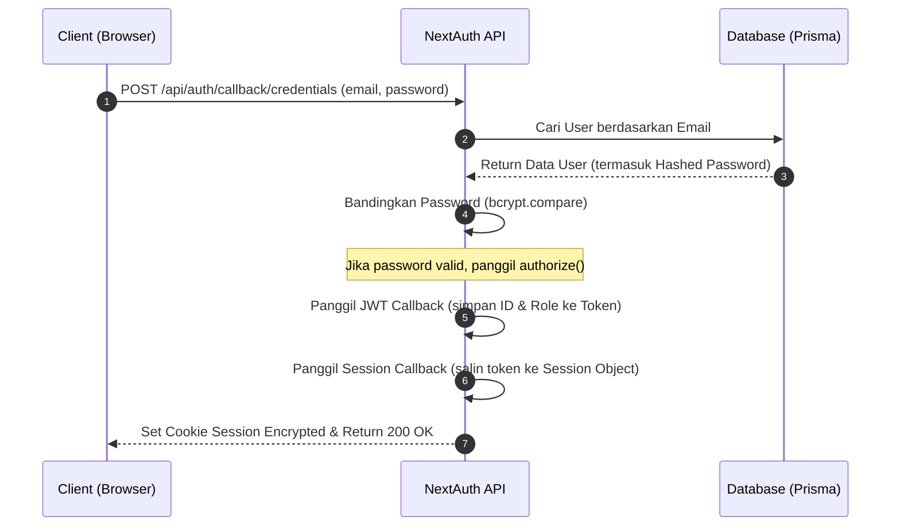

# 📋 Detail Workflow: NextAuth.js v5 (Auth.js) Configuration

Dokumen ini mendetailkan langkah-langkah setup autentikasi menggunakan NextAuth.js v5 (Auth.js) dengan strategi Credentials (email/password) dan database integration via Prisma.

---

## 1. Alur Autentikasi (Authentication Lifecycle)



---

## 2. Langkah Detail Implementasi

### Langkah 1: Setup File Konfigurasi Inti
Buat file [auth.ts](file:///d:/BARBARA%20E-commerce/src/lib/auth.ts) yang mendefinisikan providers, session strategy, dan callbacks.

1. **Credentials Authorization**:
   - Terima input `email` dan `password` dari client form.
   - Gunakan `prisma.user.findUnique` untuk mencari user.
   - Gunakan `bcrypt.compare` untuk mencocokkan password input dengan hash password di database.
   - Kembalikan objek user berisi `id`, `name`, `email`, dan `role` jika sukses, atau `null` jika kredensial salah.

2. **Callbacks Customization**:
   - **JWT Callback**:
     ```typescript
     async jwt({ token, user }) {
       if (user) {
         token.role = user.role;
         token.id = user.id;
       }
       return token;
     }
     ```
   - **Session Callback**:
     ```typescript
     async session({ session, token }) {
       if (session.user) {
         session.user.role = token.role as string;
         session.user.id = token.id as string;
       }
       return session;
     }
     ```

### Langkah 2: Setup Dynamic Route Handler
Buat file [route.ts](file:///d:/BARBARA%20E-commerce/src/app/api/auth/%5B...nextauth%5D/route.ts) untuk melayani request API NextAuth.
```typescript
import { handlers } from "@/lib/auth";
export const { GET, POST } = handlers;
```

### Langkah 3: Setup Next.js Middleware Protection
Buat file [middleware.ts](file:///d:/BARBARA%20E-commerce/src/middleware.ts) di root folder `src/`.
- Gunakan NextAuth middleware wrapper untuk mendeteksi status login user sebelum me-render halaman.
- Batasi akses ke rute `/admin/:path*` hanya untuk user yang memiliki `session.user.role === 'ADMIN'`. Jika bukan admin, redirect kembali ke `/` (home).
- Batasi akses ke `/account/:path*` dan `/checkout` hanya untuk user yang sudah login (`isLoggedIn === true`). Jika belum login, redirect ke `/auth/login`.

---

## 3. Penanganan Type Safety pada TypeScript
Karena kita menambahkan properti `role` ke dalam objek session user NextAuth, kita wajib mendeklarasikan type definition tambahan di file `src/types/next-auth.d.ts`:

```typescript
import { DefaultSession } from "next-auth";

declare module "next-auth" {
  interface Session {
    user: {
      id: string;
      role: string;
    } & DefaultSession["user"];
  }

  interface User {
    role?: string;
  }
}

declare module "next-auth/jwt" {
  interface JWT {
    id: string;
    role: string;
  }
}
```
*Pastikan file type-definition ini terdeteksi oleh compiler TypeScript dengan menambahkannya ke array `include` pada `tsconfig.json`.*
