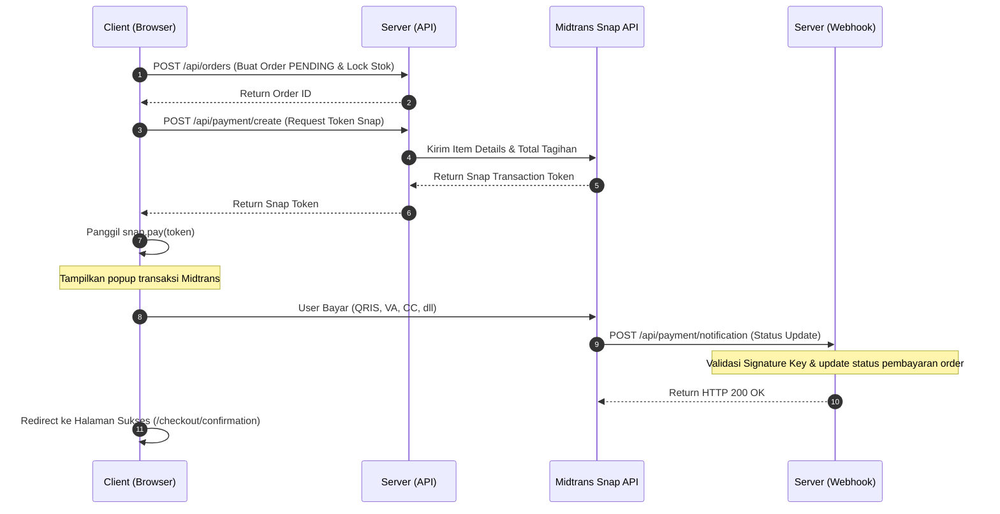

# 📋 Detail Workflow: Midtrans Snap Integration & Checkout Flow

Dokumen ini mendetailkan proses pembayaran client-server menggunakan Midtrans Snap JS, pengisian informasi pengiriman, webhook handler, pemetaan status, dan pengembalian stok saat order dibatalkan.

---

## 1. Alur Transaksi Lengkap (Transaction Lifecycle)



---

## 2. Langkah Detail Implementasi

### Langkah 1: Checkout API & Stock Lock (`/api/orders`)
Saat customer menekan tombol "Place Order" di halaman checkout:
1. Validasi input form alamat penerima (recipient, phone, address, city, dll) menggunakan Zod schema.
2. Di dalam transaksi database (`prisma.$transaction`):
   - Ambil seluruh item keranjang belanja user.
   - Periksa ketersediaan stok fisik di database (`ProductVariant.stock`). Jika stok tidak mencukupi, lempar error dan batalkan transaksi database.
   - Buat record data `Order` dengan `status: PENDING`, `paymentStatus: PENDING`, dan generate random unik `orderNumber` (misal: `BBR-2026-XXXX`).
   - Kurangi stok aktual varian produk sebanyak kuantitas yang dipesan secara langsung (`decrement`).
   - Hapus seluruh isi keranjang belanja user di database (`CartItem`).
3. Kembalikan data ID order yang sukses dibuat ke client.

### Langkah 2: Pemanggilan API Token Snap (`/api/payment/create`)
Di client, setelah berhasil membuat data order, panggil endpoint `/api/payment/create` dengan payload `{ "orderId": "..." }`:
1. Server memvalidasi hak kepemilikan data order (order tersebut harus milik user yang sedang aktif).
2. Kirim parameter transaksi detail ke API Midtrans Snap:
   - `order_id`: ID unik pesanan dari database lokal.
   - `gross_amount`: Total tagihan (jumlah harga item + estimasi biaya pengiriman).
   - `item_details`: Rincian produk (nama, harga, quantity) agar tampil di nota pembayaran Midtrans.
3. Midtrans akan mengembalikan string Snap Token. Simpan token tersebut ke kolom `midtransId` pada tabel `Order` sebagai referensi.

### Langkah 3: Eksekusi Popup Midtrans Snap di Client
1. Load script Midtrans Snap di global layout:
   `<Script src="https://app.sandbox.midtrans.com/snap/snap.js" data-client-key={process.env.NEXT_PUBLIC_MIDTRANS_CLIENT_KEY} />`
2. Eksekusi fungsi modal snap di click handler tombol bayar:
   ```javascript
   window.snap.pay(snapToken, {
     onSuccess: function(result) {
       // Kosongkan Zustand cart client
       useCartStore.getState().clearCart();
       window.location.href = `/checkout/confirmation?orderId=${orderId}`;
     },
     onPending: function(result) {
       useCartStore.getState().clearCart();
       window.location.href = `/checkout/confirmation?orderId=${orderId}`;
     },
     onError: function(result) {
       alert("Terjadi kesalahan pembayaran. Silakan coba kembali.");
     }
   });
   ```

### Langkah 4: Webhook Handler & Pemulihan Stok
Midtrans akan mengirim notifikasi HTTP POST ke `/api/payment/notification`.
1. **Validasi Signature**: Server wajib menghitung hash SHA512 dari kombinasi data payload ditambah Server Key Midtrans, lalu mencocokkannya dengan signature key dari request header/body.
2. **Status Update**:
   - Jika status transaksi adalah `settlement` atau `capture` (dengan fraud status `accept`), ubah `paymentStatus` menjadi `PAID` dan `status` menjadi `PROCESSING`.
   - Jika status transaksi adalah `deny`, `cancel`, atau `expire`, ubah `paymentStatus` menjadi `FAILED`, `status` menjadi `CANCELLED`, dan lakukan **kembalikan stok** dengan menaikkan (`increment`) jumlah stok varian produk terkait sebanyak jumlah kuantitas pesanan.
