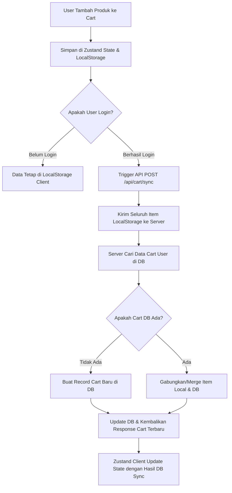

# 📋 Detail Workflow: Zustand Cart & Database Sync Flow

Dokumen ini mendetailkan langkah-langkah implementasi keranjang belanja (Cart) menggunakan Zustand state manager dengan local persistence, serta logika sinkronisasi data keranjang ke database PostgreSQL ketika user melakukan login.

---

## 1. Alur Sinkronisasi Cart (State & Database Sync Lifecycle)



---

## 2. Langkah Detail Implementasi

### Langkah 1: Setup Zustand Store dengan LocalStorage Persistence
1. Buat file [useCartStore.ts](file:///d:/BARBARA%20E-commerce/src/stores/useCartStore.ts) menggunakan middleware `persist` dari Zustand.
2. Definisikan aksi penambahan (`addItem`), penghapusan (`removeItem`), dan pembaruan kuantitas (`updateQuantity`).
3. **Constraint Penting**: Aksi `addItem` dan `updateQuantity` wajib memvalidasi kuantitas item agar tidak melebihi stok fisik produk (`maxStock`) yang didapatkan dari API backend.

### Langkah 2: Pembuatan API Handler Sinkronisasi di Server
Buat endpoint API Next.js di `src/app/api/cart/sync/route.ts`.
1. Validasi sesi user yang login menggunakan `auth()`. Jika tidak login, kembalikan status HTTP `401 Unauthorized`.
2. Terima payload body berisi array item lokal dari client:
   ```json
   [
     { "variantId": "cuid123", "quantity": 2 },
     { "variantId": "cuid456", "quantity": 1 }
   ]
   ```
3. Lakukan **Merge Logic**:
   - Cari data `Cart` milik user di database beserta `CartItem` terkait. Jika belum memiliki record `Cart`, buat baru.
   - Loop setiap item yang dikirim dari client:
     - Jika `variantId` sudah ada di database, jumlahkan kuantitas lokal dengan kuantitas database, lalu pastikan jumlahnya tidak melebihi stok aktual varian produk tersebut (`stock` pada `ProductVariant`).
     - Jika `variantId` belum ada di database, tambahkan data record `CartItem` baru.
4. Simpan seluruh perubahan menggunakan transaksi Prisma (`prisma.$transaction`) untuk menjamin konsistensi data.
5. Kembalikan array item yang telah disinkronkan ke client untuk meng-update state Zustand lokal.

### Langkah 3: Trigger Sinkronisasi pada Sisi Client
1. Di file layouts atau providers utama Next.js (`src/components/layout/Navbar.tsx` atau `SessionProvider`), buat helper `useEffect` yang memantau perubahan status login session NextAuth.
2. Saat status session berubah dari `unauthenticated` menjadi `authenticated`, panggil endpoint POST `/api/cart/sync` dengan membawa daftar item yang sedang aktif di `useCartStore.getState().items`.
3. Setelah menerima data response dari server, panggil fungsi di store Zustand untuk meng-overwrite item lokal dengan data final yang dikembalikan oleh database.
