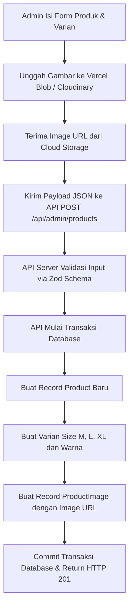

# 📋 Detail Workflow: Admin Product CRUD with Dynamic Variants

Dokumen ini mendetailkan proses pembuatan, pembaruan, dan penghapusan produk oleh admin, pengelolaan varian warna dan ukuran (M-XL), serta alur unggah gambar ke cloud storage.

---

## 1. Alur Pemrosesan Form Produk (Admin Flow)



---

## 2. Langkah Detail Implementasi

### Langkah 1: Manajemen Form State di Frontend (React Hook Form + Zod)
1. Desain form di `/admin/products/new` dan `/admin/products/[id]`.
2. Buat skema validasi Zod di `src/validators/product.ts` yang berisi aturan wajib:
   - Nama produk (string, min 3 karakter).
   - Deskripsi (string, min 10 karakter).
   - Kategori ID (string, format cuid/uuid).
   - Harga (number, minimum 1000 rupiah).
   - Array Varian: Setiap varian harus menentukan warna, nilai heksadesimal warna (contoh: `#000000`), ukuran (M, L, atau XL saja), dan jumlah stok fisik (angka >= 0).
   - Array Gambar: Minimal 1 gambar terunggah.

### Langkah 2: Proses Unggah Gambar (Client-Side ke Cloud Storage)
1. Gunakan file input HTML biasa atau drag-and-drop zone.
2. Ketika admin memilih gambar, kirim file gambar tersebut ke endpoint server-side `/api/admin/upload` atau langsung unggah menggunakan SDK cloud storage (seperti Vercel Blob atau Cloudinary).
3. Simpan string URL gambar yang dikembalikan oleh server ke state form (`images` array) sebelum form produk dikirimkan secara penuh.

### Langkah 3: Penulisan API CRUD Server-Side
Buat endpoint API dinamis di `/api/admin/products/route.ts` dan `/api/admin/products/[id]/route.ts`.
1. **Otorisasi Role**: Verifikasi session user menggunakan `auth()`. Pastikan `session.user.role === 'ADMIN'`. Jika tidak, kembalikan HTTP `403 Forbidden`.
2. **Database Transaction (`prisma.$transaction`)**:
   Saat membuat produk baru:
   - Simpan data dasar produk (nama, slug, deskripsi, price, material, care, categoryId).
   - Buat batch data `ProductVariant` terkait produk tersebut secara berurutan.
   - Buat batch data `ProductImage` terkait produk tersebut dengan mengurutkan kolom order.
3. **Database Update (Edit Flow)**:
   Saat mengupdate produk:
   - Perbarui data dasar produk.
   - Untuk data varian: Cara paling aman adalah menghapus varian lama yang tidak lagi digunakan dan membuat varian baru, ATAU melakukan upsert berdasarkan SKU unik varian.
   - Pastikan varian produk yang sedang terikat di tabel transaksi order (`OrderItem`) **tidak dihapus** untuk mencegah pelanggaran integrity constraint database.

---

## 3. Contoh Validasi Zod Schema (`src/validators/product.ts`)
```typescript
import { z } from 'zod';

export const productVariantSchema = z.object({
  size: z.enum(['M', 'L', 'XL'], { errorMap: () => ({ message: 'Ukuran harus M, L, atau XL' }) }),
  color: z.string().min(1, 'Warna wajib diisi'),
  colorHex: z.string().regex(/^#[0-9A-F]{6}$/i, 'Format hex warna tidak valid'),
  stock: z.number().int().nonnegative('Stok tidak boleh negatif'),
  sku: z.string().min(3, 'SKU minimal 3 karakter'),
});

export const productSchema = z.object({
  name: z.string().min(3, 'Nama produk minimal 3 karakter'),
  description: z.string().min(10, 'Deskripsi minimal 10 karakter'),
  categoryId: z.string().min(1, 'Kategori wajib dipilih'),
  price: z.number().positive('Harga harus bernilai positif'),
  material: z.string().optional(),
  care: z.string().optional(),
  variants: z.array(productVariantSchema).min(1, 'Minimal harus ada 1 varian produk'),
  images: z.array(z.string().url('Format URL gambar tidak valid')).min(1, 'Minimal harus mengunggah 1 gambar'),
});
```
