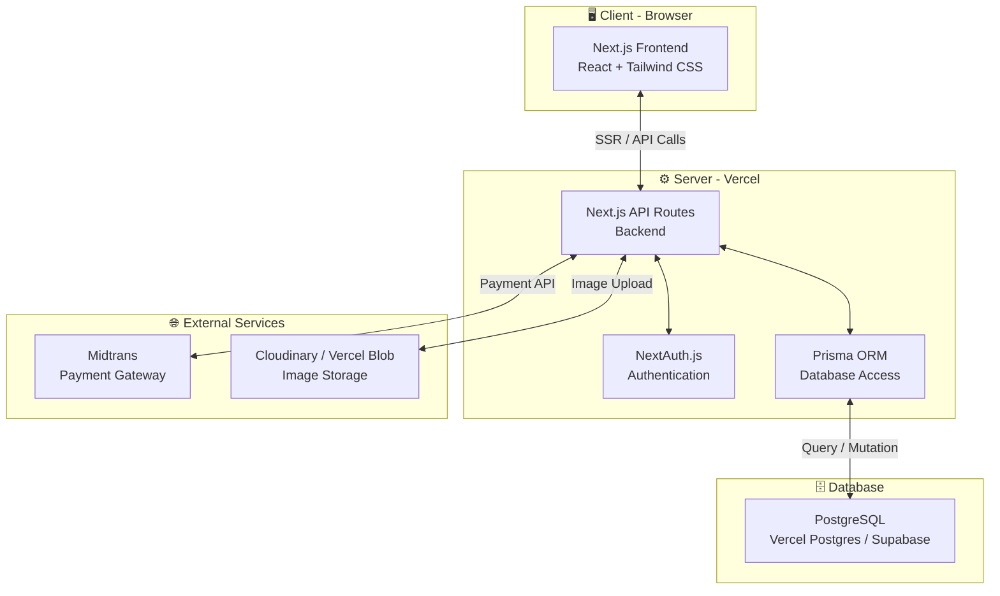
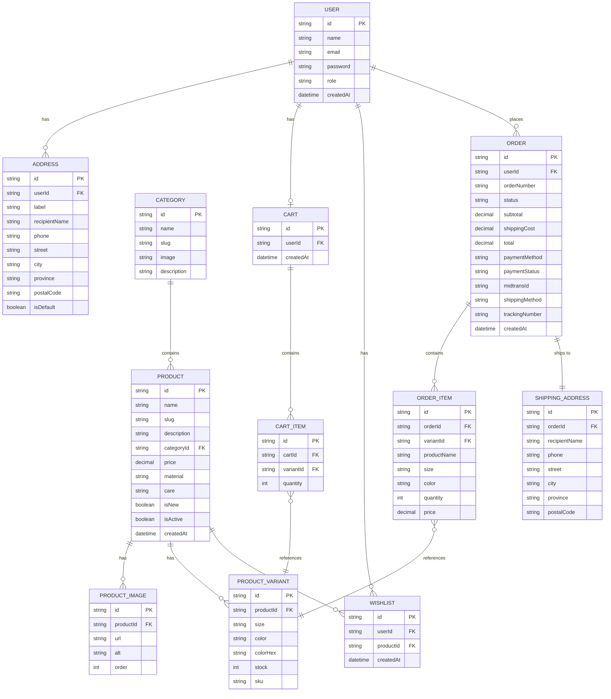

# 📋 Product Requirements Document (PRD)
# BARBARA — E-Commerce Fashion Platform

---

> **Versi**: 1.0  
> **Tanggal**: 9 Juni 2026  
> **Status**: Draft  
> **Author**: Development Team

---

## 1. Executive Summary

**BARBARA** adalah sebuah single-brand online store untuk produk fashion & apparel (pakaian, sepatu, aksesoris) yang menargetkan segmen **unisex** (pria & wanita) dengan positioning **mid-range / contemporary**. Website ini dirancang dengan pendekatan **bold & edgy** menggunakan palet warna monochrome hitam-putih untuk menciptakan kesan modern, kuat, dan fashion-forward.

Platform ini dibangun sebagai **fullstack Next.js application** dengan PostgreSQL sebagai database, Prisma sebagai ORM, dan Midtrans sebagai payment gateway — semuanya di-deploy melalui Vercel.

---

## 2. Tujuan Proyek

| Tujuan | Deskripsi |
|--------|-----------|
| **Primary** | Membangun platform e-commerce yang fungsional untuk brand BARBARA agar dapat menjual produk fashion secara online |
| **Secondary** | Menciptakan pengalaman berbelanja premium yang mencerminkan identitas brand yang bold & edgy |
| **Tertiary** | Membangun fondasi teknologi yang scalable untuk pertumbuhan bisnis di masa depan |

### Key Success Metrics
- Website load time < 3 detik
- Conversion rate target: 2-4%
- Mobile responsiveness score > 90 (Google Lighthouse)
- SEO score > 90 (Google Lighthouse)

---

## 3. Target Audiens

| Aspek | Detail |
|-------|--------|
| **Gender** | Unisex (Pria & Wanita) |
| **Usia** | 18 - 35 tahun |
| **Segmen** | Mid-range contemporary fashion enthusiast |
| **Geografi** | Indonesia (primary) |
| **Behavior** | Fashion-conscious, digitally savvy, aktif di social media |

---

## 4. Fitur Utama

### 4.1 Customer-Facing Features

| # | Fitur | Prioritas | Deskripsi |
|---|-------|-----------|-----------|
| F1 | **User Registration & Login** | 🔴 High | Registrasi via email + social login (Google, Facebook) menggunakan NextAuth.js |
| F2 | **Product Catalog** | 🔴 High | Katalog produk dengan filter (kategori, ukuran, warna, harga) dan search functionality |
| F3 | **Product Detail** | 🔴 High | Detail produk lengkap: gallery gambar, deskripsi, pilihan variant (size, color), size chart |
| F4 | **Shopping Cart** | 🔴 High | Keranjang belanja dengan update quantity, remove item, dan kalkulasi subtotal |
| F5 | **Wishlist** | 🟡 Medium | Simpan produk favorit untuk dibeli nanti |
| F6 | **Checkout & Payment** | 🔴 High | Proses checkout lengkap dengan integrasi Midtrans (QRIS, VA, e-wallet, kartu kredit) |
| F7 | **Size Guide** | 🟡 Medium | Panduan ukuran interaktif untuk membantu customer memilih ukuran yang tepat |
| F8 | **User Account / Profile** | 🔴 High | Halaman profil dengan order history, manajemen alamat, dan pengaturan akun |
| F9 | **Search** | 🔴 High | Full-text search dengan autocomplete dan hasil yang relevan |

### 4.2 Admin Dashboard Features

| # | Fitur | Prioritas | Deskripsi |
|---|-------|-----------|-----------|
| A1 | **Product Management** | 🔴 High | CRUD produk: tambah, edit, hapus produk beserta variant (size, color), harga, stok, dan gambar |
| A2 | **Order Management** | 🔴 High | Lihat, filter, dan update status pesanan (pending → processing → shipped → delivered) |
| A3 | **Customer Management** | 🟡 Medium | Lihat daftar pelanggan, detail akun, dan riwayat pembelian |
| A4 | **Dashboard Overview** | 🟡 Medium | Ringkasan statistik: total penjualan, jumlah pesanan, produk terlaris, revenue chart |
| A5 | **Inventory Management** | 🔴 High | Monitoring dan update stok produk per variant |

---

## 5. Halaman & Sections

### 5.1 Customer-Facing Pages

---

#### 📄 Homepage (`/`)

Hero section dan landing utama brand BARBARA.

| Section | Deskripsi | Komponen |
|---------|-----------|----------|
| **Navigation Bar** | Fixed top navbar | Logo BARBARA, menu links (Shop, About, Contact), search icon, wishlist icon, cart icon, user icon/login |
| **Hero Banner** | Full-width hero section | Gambar editorial besar, headline bold, CTA button "SHOP NOW" |
| **New Arrivals** | Showcase produk terbaru | Grid/carousel 4-8 produk terbaru dengan hover effect |
| **Categories** | Kategori produk utama | Grid visual kategori (Pakaian Pria, Pakaian Wanita, Sepatu, Aksesoris) |
| **Best Sellers** | Produk terlaris | Grid 4-8 produk best seller |
| **Brand Story Teaser** | Cuplikan cerita brand | Gambar + teks singkat tentang BARBARA + CTA "Discover More" |
| **Newsletter CTA** | Ajakan subscribe | Input email + tombol subscribe dengan copy yang engaging |
| **Footer** | Informasi umum | Logo, navigasi cepat, social media links, contact info, payment methods, copyright |

---

#### 📄 Product Listing / Shop Page (`/shop`)

Halaman katalog semua produk dengan kemampuan filter dan sorting.

| Section | Deskripsi | Komponen |
|---------|-----------|----------|
| **Page Header** | Judul halaman | Breadcrumb, judul "SHOP ALL" atau nama kategori |
| **Filter Sidebar / Bar** | Panel filter produk | Filter: Kategori, Ukuran (M-XL), Warna, Harga (range slider), Sort by (terbaru, harga, populer) |
| **Product Grid** | Grid produk | Card produk: gambar, nama, harga, badge (NEW/SALE), hover: secondary image + quick add |
| **Pagination / Infinite Scroll** | Navigasi halaman | Load more button atau infinite scroll |
| **Active Filters** | Filter yang aktif | Tag/chip filter yang sedang aktif dengan tombol remove |

---

#### 📄 Product Detail Page (`/shop/[slug]`)

Halaman detail lengkap sebuah produk.

| Section | Deskripsi | Komponen |
|---------|-----------|----------|
| **Breadcrumb** | Navigasi breadcrumb | Home > Shop > Kategori > Nama Produk |
| **Product Gallery** | Galeri gambar produk | Gambar utama besar + thumbnail carousel, zoom on hover, support multiple angles |
| **Product Info** | Informasi produk | Nama produk, harga, deskripsi singkat, badge (NEW/SOLD OUT) |
| **Variant Selector** | Pemilihan variant | Color swatches (visual), Size selector (button group), ketersediaan stok per variant |
| **Size Guide Link** | Link ke size guide | Button/link membuka modal size chart |
| **Add to Cart** | Aksi beli | Quantity selector + tombol "ADD TO CART" + tombol "ADD TO WISHLIST" (heart icon) |
| **Product Description** | Detail deskripsi | Tab/accordion: Deskripsi lengkap, Material & Care, Shipping Info |
| **Related Products** | Produk terkait | Carousel 4-6 produk dari kategori yang sama |

---

#### 📄 Shopping Cart Page (`/cart`)

Halaman keranjang belanja.

| Section | Deskripsi | Komponen |
|---------|-----------|----------|
| **Cart Header** | Judul | "YOUR CART" + jumlah item |
| **Cart Items** | Daftar produk | Gambar thumbnail, nama produk, variant (size/color), harga, quantity selector (+/-), tombol remove, subtotal per item |
| **Cart Summary** | Ringkasan | Subtotal, estimasi ongkir, total, tombol "PROCEED TO CHECKOUT" |
| **Continue Shopping** | Link kembali | CTA "Continue Shopping" ke halaman shop |
| **Empty State** | Keranjang kosong | Ilustrasi + teks "Your cart is empty" + CTA "START SHOPPING" |

---

#### 📄 Checkout Page (`/checkout`)

Halaman proses pembayaran.

| Section | Deskripsi | Komponen |
|---------|-----------|----------|
| **Checkout Steps** | Progress indicator | Step 1: Shipping → Step 2: Payment → Step 3: Confirmation |
| **Shipping Information** | Form alamat | Nama, telepon, alamat lengkap, kota, provinsi, kode pos + pilih alamat tersimpan |
| **Shipping Method** | Pilihan pengiriman | Opsi kurir (JNE, J&T, SiCepat, dll) dengan estimasi harga & waktu |
| **Order Summary** | Ringkasan pesanan | Daftar item, subtotal, ongkir, total pembayaran |
| **Payment** | Pembayaran | Integrasi Midtrans Snap: pilihan QRIS, Virtual Account, E-Wallet, Kartu Kredit |
| **Order Confirmation** | Konfirmasi | Halaman sukses: nomor order, detail pesanan, estimasi pengiriman |

---

#### 📄 User Account / Profile Page (`/account`)

Halaman akun pengguna dengan sub-halaman.

| Section / Sub-page | Deskripsi | Komponen |
|---------------------|-----------|----------|
| **Account Sidebar** | Navigasi akun | Menu: Profile, Orders, Addresses, Wishlist, Logout |
| **Profile** (`/account/profile`) | Data diri | Form edit: nama, email, telepon, password |
| **Order History** (`/account/orders`) | Riwayat pesanan | Tabel/list pesanan: nomor order, tanggal, status, total, detail link |
| **Order Detail** (`/account/orders/[id]`) | Detail pesanan | Timeline status, daftar item, info pengiriman, info pembayaran |
| **Addresses** (`/account/addresses`) | Manajemen alamat | List alamat tersimpan, tambah/edit/hapus alamat, set default |
| **Wishlist** (`/account/wishlist`) | Produk favorit | Grid produk yang di-wishlist, opsi move to cart |

---

#### 📄 Wishlist Page (`/wishlist`)

Halaman produk favorit (juga bisa diakses dari `/account/wishlist`).

| Section | Deskripsi | Komponen |
|---------|-----------|----------|
| **Page Header** | Judul | "YOUR WISHLIST" + jumlah item |
| **Wishlist Grid** | Grid produk | Card produk: gambar, nama, harga, tombol "ADD TO CART", tombol remove |
| **Empty State** | Kosong | Ilustrasi + "Your wishlist is empty" + CTA "EXPLORE PRODUCTS" |

---

#### 📄 About Us / Brand Story (`/about`)

Halaman cerita brand BARBARA.

| Section | Deskripsi | Komponen |
|---------|-----------|----------|
| **Hero** | Visual statement | Full-width gambar editorial + headline brand |
| **Brand Story** | Cerita brand | Narasi tentang visi, misi, dan filosofi BARBARA |
| **Values** | Nilai brand | Grid 3-4 value cards (quality, style, sustainability, dll) |
| **Behind the Scenes** | Proses pembuatan | Galeri gambar proses design/produksi |
| **CTA** | Call to action | "Shop the Collection" button |

---

#### 📄 Contact Us (`/contact`)

Halaman kontak dan bantuan.

| Section | Deskripsi | Komponen |
|---------|-----------|----------|
| **Contact Header** | Judul | Headline + sub-text |
| **Contact Form** | Form kontak | Nama, email, subject, pesan, tombol submit |
| **Contact Info** | Informasi kontak | Email, telepon, alamat, jam operasional |
| **Social Media** | Link sosmed | Icons + links ke Instagram, TikTok, dll |
| **Map** | Lokasi | Embedded Google Maps (opsional) |

---

#### 📄 FAQ / Help Center (`/faq`)

Halaman pertanyaan yang sering diajukan.

| Section | Deskripsi | Komponen |
|---------|-----------|----------|
| **Search** | Cari FAQ | Search bar untuk filter FAQ |
| **FAQ Categories** | Kategori | Tab/filter: Pemesanan, Pengiriman, Pembayaran, Pengembalian, Akun |
| **FAQ List** | Daftar FAQ | Accordion/collapsible Q&A items |
| **Still Need Help** | Bantuan lanjut | CTA ke halaman Contact Us |

---

#### 📄 Login / Register Page (`/auth/login`, `/auth/register`)

Halaman autentikasi.

| Section | Deskripsi | Komponen |
|---------|-----------|----------|
| **Brand Visual** | Visual branding | Logo BARBARA + gambar editorial (split layout) |
| **Login Form** | Form login | Email, password, remember me, forgot password link |
| **Social Login** | Login sosmed | Google login button, Facebook login button |
| **Register Form** | Form registrasi | Nama, email, password, confirm password, terms checkbox |
| **Toggle** | Switch form | Link "Don't have an account? Register" / "Already have an account? Login" |

---

#### 📄 Size Guide Page (`/size-guide`)

Halaman panduan ukuran.

| Section | Deskripsi | Komponen |
|---------|-----------|----------|
| **How to Measure** | Cara mengukur | Ilustrasi + instruksi cara mengukur tubuh |
| **Size Charts** | Tabel ukuran | Tabel ukuran per kategori (Tops, Bottoms, Shoes) dalam cm & inch |
| **Fit Guide** | Panduan fit | Penjelasan tipe fit: Slim, Regular, Oversized |

---

#### 📄 Search Results Page (`/search`)

Halaman hasil pencarian.

| Section | Deskripsi | Komponen |
|---------|-----------|----------|
| **Search Bar** | Input pencarian | Search input dengan query aktif |
| **Results Count** | Jumlah hasil | "Showing X results for 'query'" |
| **Filter** | Filter hasil | Filter sama seperti Shop Page |
| **Results Grid** | Grid produk | Card produk yang match dengan query |
| **No Results** | Tidak ada hasil | "No products found" + suggested products |

---

### 5.2 Admin Dashboard Pages

---

#### 📄 Admin Dashboard (`/admin`)

| Section | Deskripsi |
|---------|-----------|
| **Sidebar Navigation** | Menu: Dashboard, Products, Orders, Customers, Settings |
| **Stats Cards** | Total Revenue, Total Orders, Total Customers, Total Products |
| **Revenue Chart** | Grafik pendapatan (line/bar chart) harian/mingguan/bulanan |
| **Recent Orders** | Tabel 10 pesanan terbaru |
| **Top Products** | Daftar 5 produk terlaris |

#### 📄 Admin Product Management (`/admin/products`)

| Section | Deskripsi |
|---------|-----------|
| **Product List** | Tabel produk: gambar, nama, kategori, harga, stok, status, actions |
| **Add/Edit Product** | Form: nama, slug, deskripsi, kategori, harga, gambar upload, variant (size + color + stok) |
| **Bulk Actions** | Hapus massal, update status massal |

#### 📄 Admin Order Management (`/admin/orders`)

| Section | Deskripsi |
|---------|-----------|
| **Order List** | Tabel pesanan: nomor order, customer, tanggal, total, status, payment status |
| **Order Detail** | Detail pesanan: info customer, items, alamat, status timeline, update status |
| **Filter & Search** | Filter by status, tanggal, search by order ID / customer name |

#### 📄 Admin Customer Management (`/admin/customers`)

| Section | Deskripsi |
|---------|-----------|
| **Customer List** | Tabel customer: nama, email, tanggal registrasi, total orders, total spent |
| **Customer Detail** | Profil customer + riwayat pesanan |

---

## 6. Desain & Visual Identity

### 6.1 Design Style

| Aspek | Detail |
|-------|--------|
| **Style** | **Bold & Edgy** — kontras tinggi, typography besar dan impactful, visual yang kuat |
| **Vibe** | Modern, confident, fashion-forward |
| **Inspirasi** | Nike, Off-White, Alexander Wang — high contrast, bold typography, editorial feel |
| **Pendekatan** | Typography-driven design, large visuals, generous negative space |

### 6.2 Color Palette

```
┌─────────────────────────────────────────────────────────────┐
│                    BARBARA COLOR SYSTEM                      │
├─────────────────────────────────────────────────────────────┤
│                                                             │
│  PRIMARY (Monochrome)                                       │
│  ┌──────┐ ┌──────┐ ┌──────┐ ┌──────┐ ┌──────┐             │
│  │██████│ │▓▓▓▓▓▓│ │▒▒▒▒▒▒│ │░░░░░░│ │      │             │
│  │ #000 │ │ #1A1A│ │ #333 │ │ #F5F5│ │ #FFF │             │
│  │Black │ │Dark  │ │Gray  │ │Light │ │White │             │
│  └──────┘ └──────┘ └──────┘ └──────┘ └──────┘             │
│                                                             │
│  SEMANTIC COLORS                                            │
│  ┌──────┐ ┌──────┐ ┌──────┐                                │
│  │██████│ │██████│ │██████│                                 │
│  │#22C55│ │#EF4444│ │#F59E0B│                               │
│  │Success│ │Error │ │Warning│                               │
│  └──────┘ └──────┘ └──────┘                                │
│                                                             │
└─────────────────────────────────────────────────────────────┘
```

| Token | Hex Code | Usage |
|-------|----------|-------|
| `--color-black` | `#000000` | Primary text, CTA buttons, navbar, headings |
| `--color-dark` | `#1A1A1A` | Secondary backgrounds, footer, dark sections |
| `--color-gray` | `#333333` | Body text, secondary elements |
| `--color-gray-light` | `#999999` | Placeholder text, disabled states |
| `--color-light` | `#F5F5F5` | Page background, cards, subtle sections |
| `--color-white` | `#FFFFFF` | Card backgrounds, text on dark, clean spaces |
| `--color-success` | `#22C55E` | Success states, in-stock indicators |
| `--color-error` | `#EF4444` | Error states, out-of-stock, validation errors |
| `--color-warning` | `#F59E0B` | Warning states, low stock alerts |

### 6.3 Typography

| Element | Font | Weight | Size (Desktop) | Size (Mobile) |
|---------|------|--------|-----------------|----------------|
| **Logo** | Montserrat | 900 (Black) | 28px | 22px |
| **H1 (Hero)** | Montserrat | 800 (ExtraBold) | 72-96px | 36-48px |
| **H2 (Section)** | Montserrat | 700 (Bold) | 48-56px | 28-36px |
| **H3 (Subsection)** | Montserrat | 700 (Bold) | 32-36px | 22-28px |
| **H4** | Montserrat | 600 (SemiBold) | 24px | 20px |
| **Body** | Montserrat | 400 (Regular) | 16px | 14px |
| **Body Small** | Montserrat | 400 (Regular) | 14px | 12px |
| **Button** | Montserrat | 700 (Bold) | 14-16px | 14px |
| **Caption** | Montserrat | 500 (Medium) | 12px | 11px |
| **Price** | Montserrat | 700 (Bold) | 20-24px | 18px |

**Typographic Style:**
- All headings: **UPPERCASE** letter-spacing: 2-4px (untuk vibe bold & edgy)
- Body text: Normal case, line-height: 1.6-1.8
- CTA buttons: UPPERCASE, letter-spacing: 3px

### 6.4 Layout Principles

| Principle | Detail |
|-----------|--------|
| **Grid System** | 12-column grid, max-width: 1440px, padding: 20-80px |
| **Spacing** | 8px base unit, scale: 8, 16, 24, 32, 48, 64, 80, 120px |
| **Breakpoints** | Mobile: 375px, Tablet: 768px, Desktop: 1024px, Wide: 1440px |
| **Negative Space** | Generous whitespace untuk memberi napas pada konten |
| **Image Ratio** | Product: 3:4 (portrait), Hero: 16:9 atau full-width, Category: 1:1 |

### 6.5 Component Styles

#### Buttons
| Type | Style |
|------|-------|
| **Primary** | Background: Black, Text: White, Padding: 16px 40px, UPPERCASE, letter-spacing: 3px, hover: White bg + Black text |
| **Secondary** | Border: 2px solid Black, Background: Transparent, Text: Black, hover: filled Black |
| **Text Link** | Underline, Black, hover: opacity 0.7 |

#### Cards (Product)
| Property | Value |
|----------|-------|
| **Background** | White |
| **Border** | None |
| **Shadow** | None (flat design) |
| **Hover** | Image scale 1.05, show secondary image, subtle transition |
| **Image** | 3:4 ratio, object-fit: cover |
| **Info** | Product name (semibold, uppercase), Price (bold) |

#### Input Fields
| Property | Value |
|----------|-------|
| **Border** | 1px solid #E0E0E0, border-bottom only (minimal) |
| **Focus** | Border-bottom: 2px solid Black |
| **Padding** | 12px 0 |
| **Label** | Uppercase, letter-spacing: 1px, font-size: 12px |

#### Badges
| Type | Style |
|------|-------|
| **NEW** | Background: Black, Text: White, Uppercase, Small padding |
| **SALE** | Background: Black, Text: White |
| **SOLD OUT** | Background: Transparent, Border: 1px solid Black, Text: Black |

### 6.6 Animations & Micro-interactions

| Interaction | Animation |
|-------------|-----------|
| **Page Transition** | Fade-in 300ms ease |
| **Product Card Hover** | Image scale 1.05, 400ms ease-out |
| **Button Hover** | Color invert, 200ms ease |
| **Scroll Reveal** | Elements fade-up on scroll entry, staggered 100ms |
| **Menu Open** | Slide-down 300ms ease |
| **Cart Drawer** | Slide-in from right, 300ms ease |
| **Modal** | Fade + scale from 0.95, 200ms ease |
| **Loading** | Minimal skeleton loader, pulsing animation |
| **Add to Cart** | Button feedback: brief scale pulse + "Added ✓" text swap |

---

## 7. Tech Stack

### 7.1 Architecture Overview



### 7.2 Technology Breakdown

#### Frontend
| Technology | Version | Purpose |
|------------|---------|---------|
| **Next.js** | 15.x (App Router) | React framework, SSR/SSG, routing, API |
| **React** | 19.x | UI component library |
| **Tailwind CSS** | 4.x | Utility-first CSS framework |
| **TypeScript** | 5.x | Type safety |
| **Zustand** | 5.x | Lightweight state management (cart, UI state) |
| **React Hook Form** | 7.x | Form handling & validation |
| **Zod** | 3.x | Schema validation |
| **Swiper** | 11.x | Product image carousel/slider |
| **Framer Motion** | 11.x | Animation library |
| **Lucide React** | Latest | Icon library |

#### Backend
| Technology | Version | Purpose |
|------------|---------|---------|
| **Next.js API Routes** | 15.x | RESTful API endpoints |
| **Prisma** | 6.x | ORM for PostgreSQL |
| **NextAuth.js (Auth.js)** | 5.x | Authentication (email, Google, Facebook) |
| **Midtrans Node Client** | Latest | Payment gateway integration |
| **Sharp** | Latest | Image optimization |
| **Nodemailer** | Latest | Transactional emails (order confirmation, dll) |

#### Database
| Technology | Purpose |
|------------|---------|
| **PostgreSQL** | Relational database utama |
| **Vercel Postgres** (atau **Supabase**) | Managed PostgreSQL hosting |

#### DevOps & Tools
| Technology | Purpose |
|------------|---------|
| **Vercel** | Hosting & deployment (auto CI/CD dari Git) |
| **GitHub** | Version control & collaboration |
| **ESLint** | Code linting |
| **Prettier** | Code formatting |
| **Prisma Studio** | Visual database browser (development) |

### 7.3 Database Schema (High-Level)



---

## 8. API Endpoints (High-Level)

### Authentication
| Method | Endpoint | Description |
|--------|----------|-------------|
| POST | `/api/auth/register` | Register user baru |
| POST | `/api/auth/[...nextauth]` | NextAuth.js handler (login, callback, session) |

### Products
| Method | Endpoint | Description |
|--------|----------|-------------|
| GET | `/api/products` | List produk (dengan filter, search, pagination) |
| GET | `/api/products/[slug]` | Detail produk |
| GET | `/api/categories` | List kategori |

### Cart
| Method | Endpoint | Description |
|--------|----------|-------------|
| GET | `/api/cart` | Get cart user |
| POST | `/api/cart/items` | Add item ke cart |
| PATCH | `/api/cart/items/[id]` | Update quantity |
| DELETE | `/api/cart/items/[id]` | Remove item dari cart |

### Wishlist
| Method | Endpoint | Description |
|--------|----------|-------------|
| GET | `/api/wishlist` | Get wishlist user |
| POST | `/api/wishlist` | Add product ke wishlist |
| DELETE | `/api/wishlist/[id]` | Remove dari wishlist |

### Orders
| Method | Endpoint | Description |
|--------|----------|-------------|
| POST | `/api/orders` | Create order baru |
| GET | `/api/orders` | List orders user |
| GET | `/api/orders/[id]` | Detail order |

### Payment
| Method | Endpoint | Description |
|--------|----------|-------------|
| POST | `/api/payment/create` | Create Midtrans transaction |
| POST | `/api/payment/notification` | Midtrans webhook handler |

### User
| Method | Endpoint | Description |
|--------|----------|-------------|
| GET | `/api/user/profile` | Get profile |
| PATCH | `/api/user/profile` | Update profile |
| GET | `/api/user/addresses` | List addresses |
| POST | `/api/user/addresses` | Add address |
| PATCH | `/api/user/addresses/[id]` | Update address |
| DELETE | `/api/user/addresses/[id]` | Delete address |

### Admin
| Method | Endpoint | Description |
|--------|----------|-------------|
| GET | `/api/admin/dashboard` | Dashboard statistics |
| CRUD | `/api/admin/products` | Product management |
| CRUD | `/api/admin/orders` | Order management |
| GET | `/api/admin/customers` | Customer management |

---

## 9. Non-Functional Requirements

### 9.1 Performance
| Metric | Target |
|--------|--------|
| First Contentful Paint (FCP) | < 1.5s |
| Largest Contentful Paint (LCP) | < 2.5s |
| Cumulative Layout Shift (CLS) | < 0.1 |
| Time to Interactive (TTI) | < 3s |
| Lighthouse Performance Score | > 90 |

### 9.2 SEO
| Requirement | Implementation |
|-------------|----------------|
| Meta tags | Dynamic per page (title, description, og:image) |
| Structured data | JSON-LD untuk Product, BreadcrumbList, Organization |
| Sitemap | Auto-generated sitemap.xml |
| Robots.txt | Configured untuk search engine crawling |
| Canonical URLs | Setiap halaman memiliki canonical URL |
| Image optimization | Next.js Image component, WebP format, lazy loading |

### 9.3 Security
| Requirement | Implementation |
|-------------|----------------|
| HTTPS | Enforced via Vercel |
| Authentication | NextAuth.js dengan secure session handling |
| Input Validation | Zod schema validation di server-side |
| CSRF Protection | NextAuth.js built-in CSRF |
| Rate Limiting | API rate limiting untuk prevent abuse |
| SQL Injection | Prevented via Prisma ORM parameterized queries |

### 9.4 Responsiveness
| Breakpoint | Min Width | Layout |
|------------|-----------|--------|
| Mobile | 0px | Single column, hamburger menu, stacked layout |
| Tablet | 768px | 2-column grid, condensed nav |
| Desktop | 1024px | Full layout, sidebar filters, multi-column grid |
| Wide | 1440px | Max-width container, optimal reading width |

---

## 10. Project Milestones

| Phase | Milestone | Estimasi |
|-------|-----------|----------|
| **Phase 1** | Project Setup & Design System | Minggu 1-2 |
| | Next.js setup, Tailwind config, typography, component library, Prisma schema | |
| **Phase 2** | Core Pages & Product Catalog | Minggu 3-5 |
| | Homepage, Shop Page, Product Detail, Search, Size Guide, About, Contact, FAQ | |
| **Phase 3** | Auth & User Features | Minggu 6-7 |
| | Registration, Login, User Profile, Address Management, Wishlist | |
| **Phase 4** | Cart & Checkout | Minggu 8-10 |
| | Shopping Cart, Checkout Flow, Midtrans Integration, Order Confirmation | |
| **Phase 5** | Admin Dashboard | Minggu 11-13 |
| | Dashboard Overview, Product CRUD, Order Management, Customer List | |
| **Phase 6** | Testing & Launch | Minggu 14-16 |
| | QA testing, performance optimization, SEO audit, deployment to production | |

---

## 11. Folder Structure

```
barbara-ecommerce/
├── public/
│   ├── fonts/
│   ├── images/
│   └── favicon.ico
├── src/
│   ├── app/
│   │   ├── (auth)/
│   │   │   ├── login/
│   │   │   └── register/
│   │   ├── (shop)/
│   │   │   ├── shop/
│   │   │   │   └── [slug]/
│   │   │   ├── cart/
│   │   │   ├── checkout/
│   │   │   ├── wishlist/
│   │   │   └── search/
│   │   ├── (pages)/
│   │   │   ├── about/
│   │   │   ├── contact/
│   │   │   ├── faq/
│   │   │   └── size-guide/
│   │   ├── account/
│   │   │   ├── profile/
│   │   │   ├── orders/
│   │   │   │   └── [id]/
│   │   │   ├── addresses/
│   │   │   └── wishlist/
│   │   ├── admin/
│   │   │   ├── products/
│   │   │   │   ├── new/
│   │   │   │   └── [id]/
│   │   │   ├── orders/
│   │   │   │   └── [id]/
│   │   │   └── customers/
│   │   ├── api/
│   │   │   ├── auth/
│   │   │   ├── products/
│   │   │   ├── cart/
│   │   │   ├── wishlist/
│   │   │   ├── orders/
│   │   │   ├── payment/
│   │   │   ├── user/
│   │   │   └── admin/
│   │   ├── layout.tsx
│   │   ├── page.tsx
│   │   └── globals.css
│   ├── components/
│   │   ├── ui/           (reusable UI: Button, Input, Modal, Badge, etc.)
│   │   ├── layout/       (Navbar, Footer, Sidebar, etc.)
│   │   ├── product/      (ProductCard, ProductGrid, ProductGallery, etc.)
│   │   ├── cart/          (CartItem, CartSummary, etc.)
│   │   ├── checkout/     (CheckoutForm, PaymentSection, etc.)
│   │   └── admin/        (AdminSidebar, StatsCard, DataTable, etc.)
│   ├── lib/
│   │   ├── prisma.ts     (Prisma client singleton)
│   │   ├── auth.ts       (NextAuth config)
│   │   ├── midtrans.ts   (Midtrans client config)
│   │   └── utils.ts      (helper functions)
│   ├── hooks/            (custom React hooks)
│   ├── stores/           (Zustand stores: cart, wishlist, UI)
│   ├── types/            (TypeScript type definitions)
│   └── validators/       (Zod validation schemas)
├── prisma/
│   ├── schema.prisma
│   └── seed.ts
├── tailwind.config.ts
├── next.config.ts
├── tsconfig.json
├── package.json
└── .env.local
```

---

## 12. Appendix

### Environment Variables (.env.local)

```env
# Database
DATABASE_URL="postgresql://..."

# NextAuth
NEXTAUTH_URL="http://localhost:3000"
NEXTAUTH_SECRET="your-secret-key"

# Google OAuth
GOOGLE_CLIENT_ID="..."
GOOGLE_CLIENT_SECRET="..."

# Facebook OAuth  
FACEBOOK_CLIENT_ID="..."
FACEBOOK_CLIENT_SECRET="..."

# Midtrans
MIDTRANS_SERVER_KEY="..."
MIDTRANS_CLIENT_KEY="..."
MIDTRANS_IS_PRODUCTION=false

# Image Storage
CLOUDINARY_CLOUD_NAME="..."
CLOUDINARY_API_KEY="..."
CLOUDINARY_API_SECRET="..."
```

---

> **Dokumen ini adalah living document yang akan di-update seiring perkembangan proyek.**
